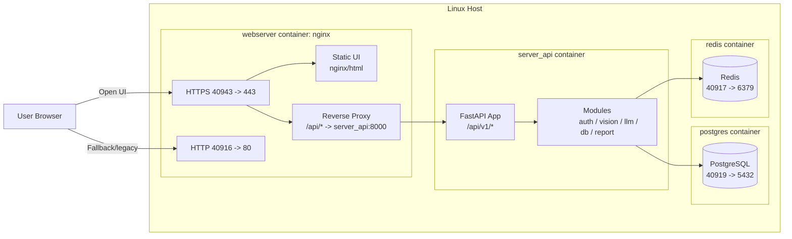
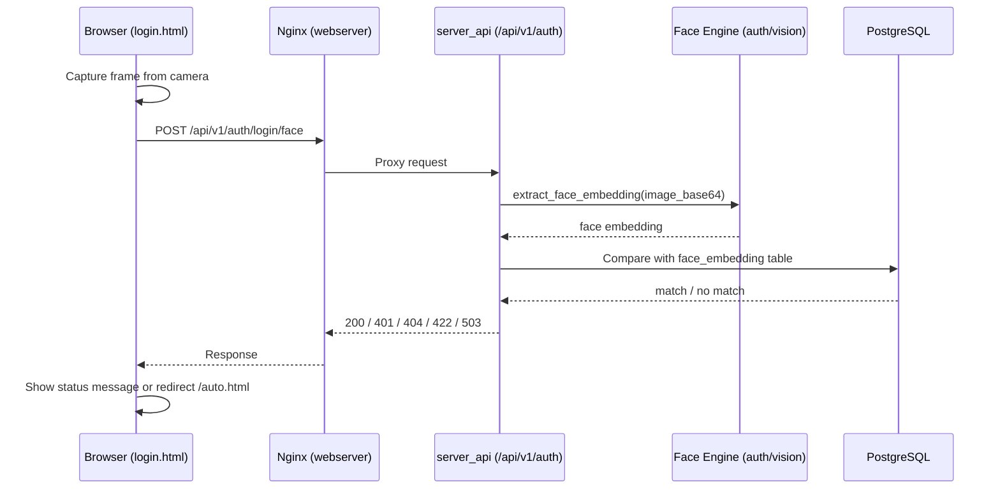

# Final Project RSS Architecture Overview

## 1) Deployment Structure (Docker Compose)

## 2) Face ID Login Request Path

## 3) Port Map

- `40943`: Nginx HTTPS (recommended entry)
- `40916`: Nginx HTTP
- `40918`: server_api direct access
- `40919`: PostgreSQL
- `40917`: Redis
