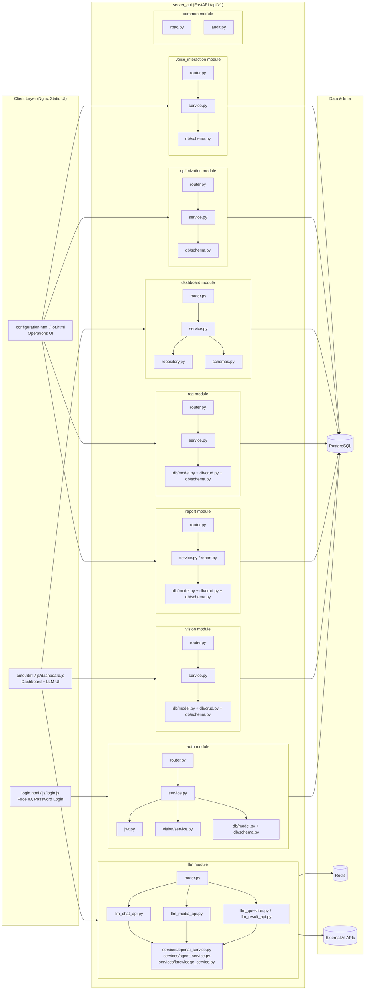
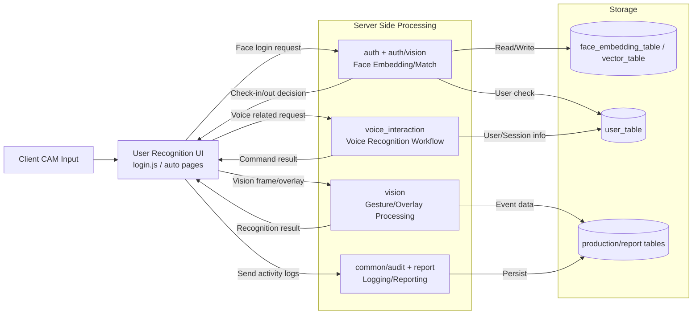

# Final Project RSS Module Architecture

요청하신 것처럼 "모듈 단위"로 바로 볼 수 있게 구성했습니다.

## 1) Backend Module Map (Code-Centric)

## 2) Face / Voice / Gesture Pipeline View (Operational)

## 3) Module Responsibility Quick Table

| Module | Main Role | Key Files |
|---|---|---|
| `auth` | Password/Face 인증, JWT, 계정 상태 검사 | `router.py`, `service.py`, `jwt.py`, `vision/service.py` |
| `vision` | 카메라/오버레이/비전 데이터 처리 | `router.py`, `service.py`, `db/*` |
| `llm` | 채팅/미디어/질문/지식기반 LLM 처리 | `router.py`, `llm_*`, `services/*` |
| `dashboard` | KPI/대시보드 집계 API | `router.py`, `service.py`, `repository.py` |
| `report` | 리포트 생성/조회 | `router.py`, `service.py`, `report.py`, `db/*` |
| `rag` | RAG 관련 데이터/질의 | `router.py`, `service.py`, `db/*` |
| `optimization` | 최적화 관련 API | `router.py`, `service.py`, `db/schema.py` |
| `voice_interaction` | 음성 인터랙션 API | `router.py`, `service.py`, `db/schema.py` |
| `common` | 공통 RBAC/감사 유틸 | `rbac.py`, `audit.py` |
