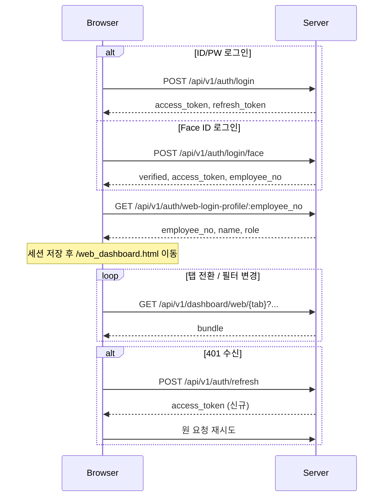
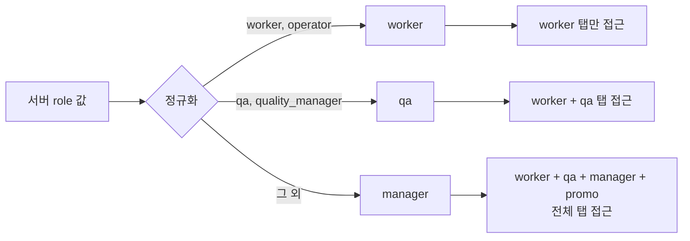
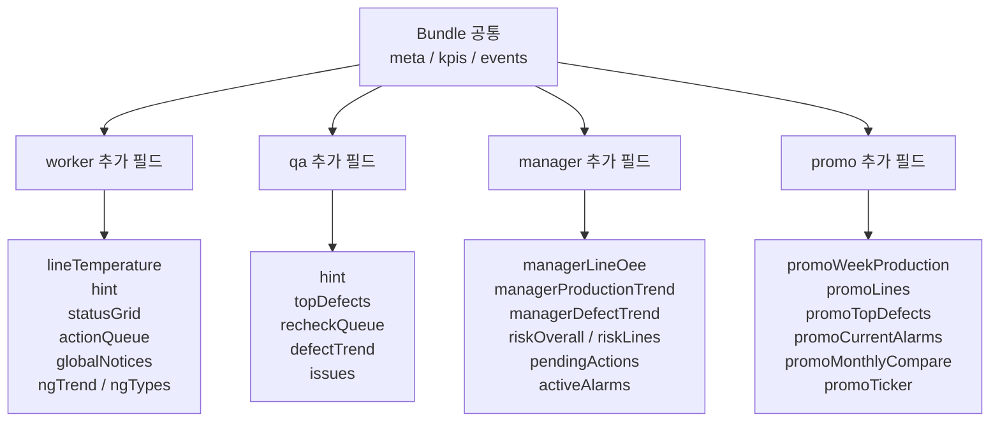
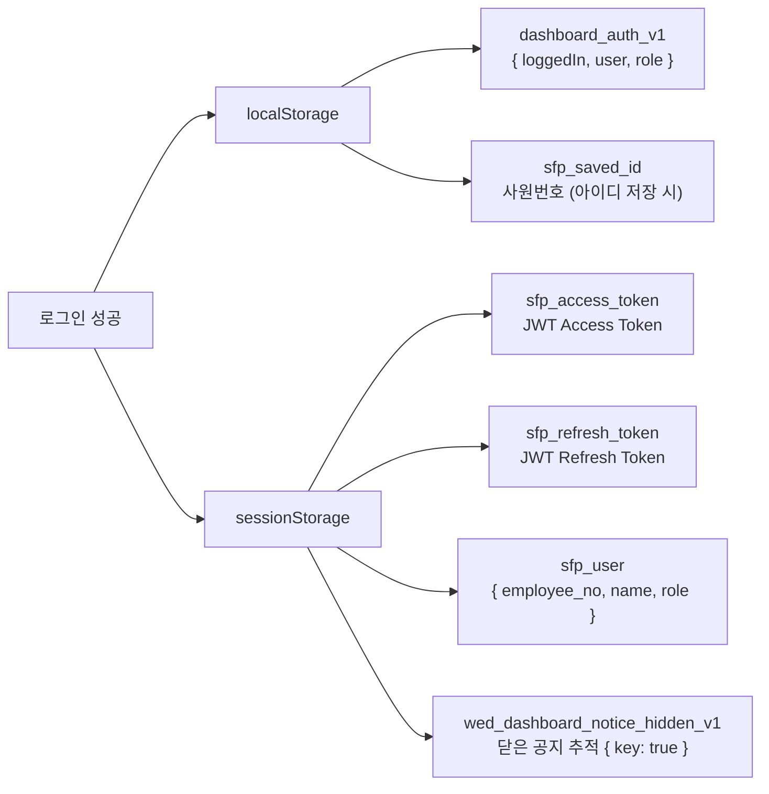

# Web Dashboard API 명세서

> 대상: `web_login.html` + `web_dashboard.html` 브라우저 흐름
> PyQt/on-device 흐름(`login.html`, `js/dashboard.js`)과 무관

---

## 공통 사항

- 모든 요청: `credentials: same-origin`
- 인증 헤더: `Authorization: Bearer <access_token>`
- 에러 응답 형식: `{ "detail": string }` 또는 `{ "message": string }`
- 401 수신 시: refresh token으로 자동 재발급 1회 → 재시도 → 실패 시 `/web_login.html` 리다이렉트
- 번들 API 자동 갱신 주기: **3초** (탭이 숨김 상태이거나 세션이 없으면 중단)

---

## 인증 흐름



---

## 인증 API

### 1. ID/PW 로그인

```
POST /api/v1/auth/login
Content-Type: application/json
```

**Request**
```json
{
  "employee_no": "string",
  "password": "string"
}
```

**Response 200**
```json
{
  "access_token": "string",
  "refresh_token": "string"
}
```

---

### 2. Face ID 로그인

```
POST /api/v1/auth/login/face
Content-Type: application/json
```

**Request**
```json
{
  "employee_no": "string | null",
  "image_base64": "data:image/jpeg;base64,..."
}
```
> `employee_no` 생략(null) 시 전체 등록 얼굴에서 비교

**Response 200**
```json
{
  "verified": true,
  "access_token": "string",
  "employee_no": "string"
}
```

**에러 코드**

| Status | 의미 |
|--------|------|
| 401 | 얼굴 불일치 |
| 404 | 등록된 얼굴 없음 |
| 422 | 얼굴 인식 실패 (조명 등) |
| 503 | InsightFace 엔진 준비 중 |

---

### 3. 로그인 프로필 조회

```
GET /api/v1/auth/web-login-profile/:employee_no
Authorization: Bearer <access_token>
```

> 로그인 성공 직후 탭 권한 확정을 위해 반드시 호출

**Response 200**
```json
{
  "employee_no": "string",
  "name": "string",
  "role": "worker | qa | quality_manager | manager | ..."
}
```

---

### 4. 토큰 갱신

```
POST /api/v1/auth/refresh
Content-Type: application/json
```

**Request**
```json
{
  "refresh_token": "string"
}
```

**Response 200**
```json
{
  "access_token": "string"
}
```

---

## 권한 및 탭 접근



> `worker` role은 필터바 자체가 숨겨지며, 번들 API 쿼리 파라미터(factory/line/shift/period)를 전송하지 않음 — 서버가 로그인 계정 기준으로 자동 스코핑

---

## 대시보드 번들 API

탭 전환 또는 필터 변경 시 호출. 응답은 직접 번들 또는 `{ "data": bundle }` 래핑 모두 허용.

```
GET /api/v1/dashboard/web/{tab}
Authorization: Bearer <access_token>
```

| `{tab}` | 설명 |
|---------|------|
| `worker` | 작업자 탭 |
| `qa` | 품질관리자 탭 |
| `manager` | 관리자 탭 |
| `promo` | 공용 송출 탭 |

**Query Parameters** (worker role은 무시)

| 파라미터 | 값 |
|----------|----|
| `factory` | `본사 1공장` |
| `line` | `LINE-A` \| `LINE-B` \| `LINE-C` \| `LINE-D` |
| `shift` | `주간` \| `야간` |
| `period` | `` (오늘, 기본) \| `yesterday` \| `weekly` |
| `date_from` | `YYYY-MM-DD` (`yesterday`/`weekly` 선택 시 자동 계산) |
| `date_to` | `YYYY-MM-DD` (`yesterday`/`weekly` 선택 시 자동 계산) |

---

### 공통 응답 구조 (필수)

```json
{
  "meta": {
    "factory": "string",
    "line": "string | null",
    "shift": "string",
    "model": "string"
  },
  "kpis": [
    {
      "id": "string",
      "label": "string",
      "value": "number",
      "unit": "string",
      "target": "number (optional)",
      "status": "ok | warning | critical",
      "meta": "string"
    }
  ],
  "events": [
    { "color": "#hex", "meta": "string", "text": "string" }
  ]
}
```

> `meta`와 `kpis[]`는 필수. 누락 시 프론트엔드에서 오류 처리.

---

### 번들 구조 요약 (탭별)



---

### Worker 탭 추가 필드

```
KPI ids: worker_hourly_output, worker_line_output, worker_recent_10m_ng, worker_achievement
```

| 필드 | 구조 |
|------|------|
| `lineTemperature` | `{ line, current, unit, status, warning, critical, updatedAt }` |
| `hint` | `{ value, confidence }` |
| `statusGrid[]` | `{ id, type, status, opr, ng, time, detail }` |
| `actionQueue[]` | `{ priority, target, reason, severity, time }` |
| `globalNotices[]` | `{ color, meta, text }` |
| `ngTrend[]` | `{ time, ng }` |
| `ngTypes[]` | `{ name, count, color }` |

---

### QA 탭 추가 필드

```
KPI ids: qa_defect_rate, qa_recheck, qa_inspect, qa_total_output
```

| 필드 | 구조 |
|------|------|
| `hint` | `{ value, severity }` |
| `topDefects[]` | `{ class_name, causeCode, count, color }` |
| `recheckQueue[]` | `{ lotId, defectClass, priority, severity, queuedAt, count, cause }` |
| `defectTrend[]` | `{ time, actual }` |
| `issues[]` | `{ id, title, cause, equip, severity, action, owner, time }` |

---

### Manager 탭 추가 필드

```
KPI ids: mgr_oee, mgr_achievement, mgr_today_output, mgr_expected_output
```

| 필드 | 구조 |
|------|------|
| `managerLineOee[]` | `{ line, actual, target }` |
| `managerProductionTrend[]` | `{ time, actual, plan }` |
| `managerDefectTrend[]` | `{ time, rate }` |
| `riskOverall` | `{ severity, reason }` |
| `riskLines[]` | `{ lineId, summary, riskScore, severity }` |
| `pendingActions[]` | `{ priority, title, summary, count }` |
| `activeAlarms[]` | `{ alarmId, line, equip, cause, severity, ack, time }` |

---

### Promo 탭 추가 필드

```
KPI ids: promo_today_output, promo_month_output, promo_oee, promo_defect_rate, promo_delivery_rate
```

| 필드 | 구조 |
|------|------|
| `promoWeekProduction[]` | `{ day, actual, target }` |
| `promoLines[]` | `{ line, status, badge, output, defectRate?, stopTime?, oee, oeeStatus }` |
| `promoTopDefects[]` | `{ name, count, color }` |
| `promoCurrentAlarms[]` | `{ severity, line, message, time }` |
| `promoMonthlyCompare[]` | `{ label, value, diff, tone }` |
| `promoTicker[]` | `string[]` |

---

## 상세 모달 API

KPI 카드 또는 알람 항목 클릭 시 호출.

```
GET /api/v1/dashboard/detail
Authorization: Bearer <access_token>
```

### Request 파라미터

| 파라미터 | 타입 | 예시 값 | 설명 |
|----------|------|---------|------|
| `screen` | string | `qa` \| `manager` | 호출 출처 탭 |
| `detailId` | string | `qa.reinspection.queue` \| `common.alarm.detail` | 상세 항목 유형 식별자 |
| `targetType` | string | `lot` \| `alarm` | 조회 대상 유형 |
| `targetId` | string | `LOT-88421` \| `ALM-2401` | 조회 대상 ID |

### Response 200 구조

```json
{
  "targetType": "string",
  "targetId": "string",
  "screen": "string",
  "summary": [ { ...key-value 행 } ],
  "logs": [ { ...key-value 행 } ],
  "relatedItems": [ { ...key-value 행 } ]
}
```

> 프론트엔드는 `summary[0]`, `logs[0~2]`, `relatedItems[0~1]`까지만 렌더링

### 응답 key → 화면 레이블 매핑

| 응답 키 | 표시 레이블 |
|---------|-------------|
| `ack_status` | ACK 상태 |
| `alarm_code` | 알람 코드 |
| `created_at` | 생성 시각 |
| `defect_qty` | 불량 수량 |
| `defect_type` | 불량 유형 |
| `equip_code` | 설비 |
| `handled_at` | 처리 시각 |
| `handled_by` | 처리자 |
| `inspection_type` | 검사 유형 |
| `line_code` | 라인 |
| `lot_id` | LOT |
| `model_code` | 모델 |
| `note` | 메모 |
| `occurred_at` | 발생 시각 |
| `queue_status` | 재검 상태 |
| `recorded_at` | 기록 시각 |
| `request_type` | 요청 유형 |
| `result_status` | 판정 |
| `severity` | 심각도 |
| `status` | 상태 |
| `summary` | 요약 |
| `total_checked_qty` | 검사 수량 |
| `user_name` | 담당자 |

> 위 목록에 없는 키는 snake_case → Title Case 자동 변환 후 표시

---

## 세션 구조



> 유효 세션 판단 조건: `dashboard_auth_v1.loggedIn === true` **AND** `sfp_access_token` 존재

| 스토리지 | 키 | 값 |
|----------|----|----|
| localStorage | `dashboard_auth_v1` | `{ loggedIn: bool, user: string, role: string }` |
| localStorage | `sfp_saved_id` | 저장된 사원번호 |
| sessionStorage | `sfp_access_token` | JWT access token |
| sessionStorage | `sfp_refresh_token` | JWT refresh token |
| sessionStorage | `sfp_user` | `{ employee_no, name, role }` |
| sessionStorage | `wed_dashboard_notice_hidden_v1` | `{ [noticeKey]: true }` |
