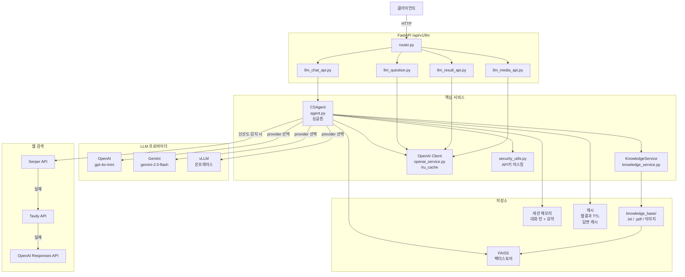
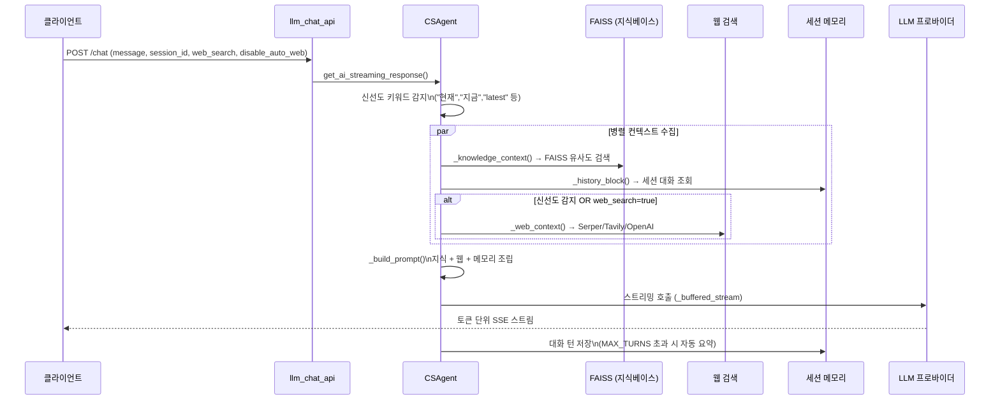
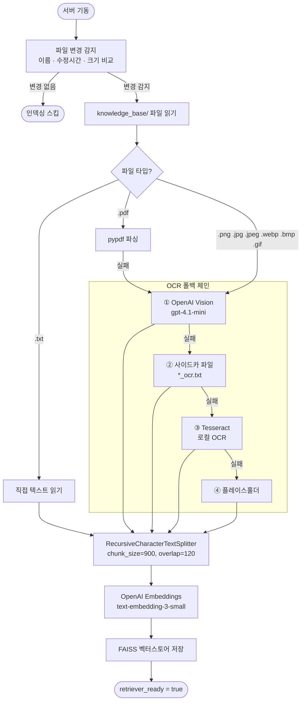
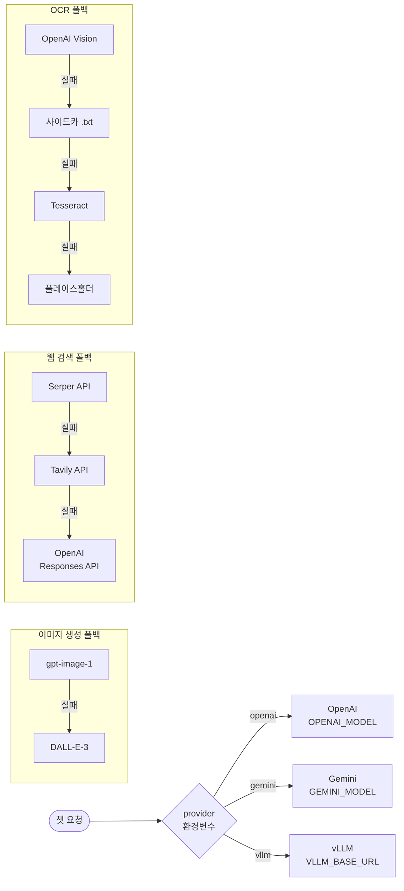

# LLM 모듈 시스템 아키텍처 기술서

**작성일:** 2026-03-23
**대상 경로:** `server_api/src/modules/llm/`
**API 베이스:** `/api/v1/llm`

---

## 1. 개요

FastAPI 기반 LLM 서비스 모듈. OpenAI · Gemini · vLLM 멀티 프로바이더를 지원하며, RAG(지식베이스 검색) + 웹 검색 + 세션 메모리를 결합한 스트리밍 챗봇 시스템이다. STT / TTS / 이미지 생성 미디어 기능을 포함한다.

---

## 2. 전체 시스템 구조



---

## 3. 모듈 파일 구조

```
llm/
├── router.py               # 최상위 라우터 (prefix: /llm)
├── llm_chat_api.py         # 챗 API 엔드포인트
├── llm_media_api.py        # STT / TTS / 이미지 생성 엔드포인트
├── llm_result_api.py       # 단순 단일 추론 엔드포인트
├── llm_question.py         # 추천 질문 생성
├── llm_simple.py           # Gemini REST 직접 호출 (SDK 미사용)
├── agent.py                # 핵심 에이전트 (CSAgent, 2,267줄)
├── knowledge_base/         # 지식 파일 보관 디렉토리
│   ├── pcb defect 원인 조치.pdf
│   └── 새 텍스트 문서.txt
└── services/
    ├── agent_service.py    # 싱글톤 에이전트 DI 래퍼
    ├── knowledge_service.py # 지식베이스 인덱싱 (546줄)
    ├── openai_service.py   # OpenAI 클라이언트 팩토리 (lru_cache)
    └── security_utils.py   # API 키 난독화 유틸리티
```

---

## 4. 핵심 컴포넌트

### 4.1 CSAgent (`agent.py`) — 챗 요청 흐름

서버가 실행되는 동안 하나만 유지되는 에이전트 인스턴스.



| 기능 | 구현 |
|---|---|
| LLM 프로바이더 | OpenAI / Gemini / vLLM (환경변수로 선택) |
| 웹 검색 | Serper → Tavily → OpenAI Responses API (우선순위 순) |
| 지식 검색 | FAISS 벡터스토어 (embedding: `text-embedding-3-small`) |
| 세션 메모리 | 대화 턴 관리 + 요약 (`HISTORY_MAX_TURNS` 초과 시 자동 압축) |
| 응답 방식 | 토큰 단위 스트리밍 (`_buffered_stream`) |
| 캐싱 | 웹 결과(TTL OrderedDict), 답변, LLM 클라이언트 |

---

### 4.2 KnowledgeService (`services/knowledge_service.py`) — 인덱싱 흐름



**지원 파일 유형:**

| 파일 유형 | 처리 방식 |
|---|---|
| `.txt` | 직접 텍스트 읽기 |
| `.pdf` | pypdf 파싱 → 실패 시 OCR 폴백 |
| `.png / .jpg / .jpeg / .webp / .bmp / .gif` | OpenAI Vision API (`gpt-4.1-mini`) OCR |

---

### 4.3 멀티 프로바이더 & 폴백 전략



---

## 5. API 엔드포인트

### 5.1 챗

| Method | Path | 설명 |
|---|---|---|
| POST | `/chat` | 스트리밍 챗 (message, provider, web_search, disable_auto_web, empathy_level, language, session_id) |
| GET | `/memory` | 세션 메모리 조회 |
| POST | `/memory/reset` | 세션 메모리 초기화 |
| GET | `/knowledge` | 지식베이스 상태 (인덱싱 진행률 포함) |
| GET | `/knowledge/files` | 인덱스 파일 목록 |
| POST | `/knowledge/reindex` | 수동 재인덱싱 |
| POST | `/upload` | 지식 파일 업로드 (.txt / .pdf / .png .jpg .jpeg .webp .bmp .gif, 최대 20MB) |
| GET | `/health/web` | 웹 검색 진단 |

### 5.2 미디어

| Method | Path | 설명 |
|---|---|---|
| POST | `/stt` | 음성 → 텍스트 (`gpt-4o-mini-transcribe`, 영어 번역 옵션 포함) |
| POST | `/tts` | 텍스트 → 음성 (`gpt-4o-mini-tts`, 6가지 voice) |
| POST | `/image` | 이미지 생성 (`gpt-image-1` 우선, 실패 시 `DALL-E-3`) |

### 5.3 기타

| Method | Path | 설명 |
|---|---|---|
| POST | `/result` | 단순 단일 추론 (temperature, max_output_tokens 지정 가능) |
| GET | `/recommended-questions` | 추천 질문 생성 (`gpt-4o-mini`, 기본 3개·최대 8개, 실패 시 하드코딩 기본값 반환) |

---

## 6. 주요 환경변수

```env
# LLM 프로바이더
OPENAI_API_KEY
GOOGLE_API_KEY            # Gemini
SERPER_API_KEY            # 웹 검색 1순위
TAVILY_API_KEY            # 웹 검색 2순위
VLLM_API_KEY
VLLM_BASE_URL

# 모델 지정
OPENAI_MODEL              # 기본 챗 모델
OPENAI_WEB_MODEL          # 웹 검색 챗 모델 (gpt-4.1-mini)
OPENAI_VISION_MODEL       # OCR 모델 (gpt-4.1-mini)
OPENAI_STT_MODEL
OPENAI_TTS_MODEL
OPENAI_IMAGE_MODEL
GEMINI_MODEL
VLLM_MODEL
EMBEDDING_MODEL           # text-embedding-3-small

# 메모리 설정
HISTORY_MAX_TURNS
HISTORY_RECENT_TURNS
HISTORY_SUMMARY_CHARS

# 캐시 TTL
WEB_CACHE_TTL_SEC
WEB_FRESH_CACHE_TTL_SEC
ANSWER_CACHE_TTL_SEC

# 지식베이스
LLM_KNOWLEDGE_PATH        # 지식 파일 디렉토리 경로
```

---

## 7. 주요 의존 라이브러리

| 패키지 | 버전 | 용도 |
|---|---|---|
| openai | 1.68.2 | LLM / STT / TTS / 이미지 / Vision OCR |
| langchain | 0.3.27 | 에이전트 프레임워크 |
| langchain-openai | 0.3.11 | OpenAI LangChain 연동 |
| langchain-community | 0.3.21 | FAISS 벡터스토어, 문서 로더 |
| faiss-cpu | 1.8.0 | 벡터 유사도 검색 |
| google-generativeai | 0.7.2 | Gemini SDK |
| pypdf | 5.4.0 | PDF 파싱 |
| pytesseract | 0.3.13 | 로컬 OCR (선택사항) |
| fastapi | 0.116.1 | API 서버 |

---

## 8. 아키텍처 특징 요약

| 항목 | 내용 |
|---|---|
| **싱글톤** | `CSAgent` 서버 실행 중 하나만 유지, Lock으로 세션 상태 보호 |
| **폴백 설계** | 웹 검색 3단, OCR 4단, 이미지 모델 2단 폴백 체인 |
| **보안** | `security_utils.py`로 에러 메시지 내 API 키 자동 마스킹 |
| **자동 인덱싱** | 서버 기동 시 파일 변경이 있으면 백그라운드에서 자동 재인덱싱 |
| **LangChain 선택적** | FAISS 미설치 시 `_LiteDocument`로 폴백, 서버 구동은 항상 가능 |
